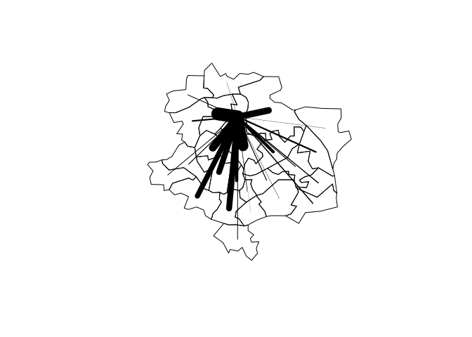

# pct: Propensity to cycle tool

This repository allows users to estimate the 'propensity to cycle' between
different origin-destination pairs.

The project is funded by the Department for Transport (DfT) so the initial
case studies will be taken from the UK. However, it is expected that the 
methods will be of use elsewhere. For that reason, attempts have been made
to make the examples generalisable. All examples presented here
are reproducible using code in this [repository](https://github.com/Robinlovelace/pct)
and data stored in the [pct-data repository](https://github.com/Robinlovelace/pct-data/).

So, if you run the following lines of code on your computer from within
[this folder](https://github.com/Robinlovelace/pct/archive/master.zip), you should get the same result. Reproducible research!

## A simple example


```r
# system("git clone git@github.com:Robinlovelace/pct-data.git") # see set-up.R
source("set-up.R")
# load some flow data
fleeds <- read.csv("pct-data/leeds/sample-leeds-centre-dists.csv")
# load the zones
leeds <- readOGR("pct-data/leeds/", "leeds-central-sample")
```

```
## OGR data source with driver: ESRI Shapefile 
## Source: "pct-data/leeds/", layer: "leeds-central-sample"
## with 25 features
## It has 3 fields
```

Now we can estimate propensity to cycle, by using the distance
decay function from [(Iacono et al. 2010)](http://linkinghub.elsevier.com/retrieve/pii/S0966692309000210):

$$
 p = \alpha \times e^{- \beta \times d}
$$

where $\alpha$, the proportion of made for the shortest distances
and $\beta$, the rate of decay
are parameters to be calculated from empirical evidence. 

To implement this understanding in R code we can use the following function:


```r
# Distance-dependent mode switch probs
iac <- function(x, a = 0.3, b = 0.2){
  a * exp(1)^(-b * x)
}
```

Apply this function to openly accessible flow data:


```r
fleeds$p_cycle <- iac(fleeds$dist / 1000)
fleeds$n_cycle <- fleeds$p_cycle * fleeds$All.categories..Method.of.travel.to.work
fleeds$pc1 <- fleeds$n_cycle - fleeds$Bicycle
```

Now we can create a simple visualisation of the result:


```r
plot(leeds)

for(i in which(fleeds$Area.of.residence == leeds$geo_code[1])){
  from <- leeds$geo_code %in% fleeds$Area.of.residence[i]
  to <- leeds$geo_code %in% fleeds$Area.of.workplace[i]
  x <- coordinates(leeds[from, ])
  y <- coordinates(leeds[to, ])
  lines(c(x[1], y[1]), c(x[2], y[2]), lwd = fleeds$pc1[i] )
}
```

 

## Set the `CS_API_KEY` Environment variable

Some of the examples pull data from the
[CycleStreets.net API](http://www.cyclestreets.net/api/).
Once you have a token, you can add it in Ubuntu as
a session variable


```bash
echo "export CS_API_KEY='my_token'" >> ~/.profile
```

or system wide variable


```bash
sudo echo "export CS_API_KEY='my_token'" > /etc/profile.d/cyclestreet.sh
```
